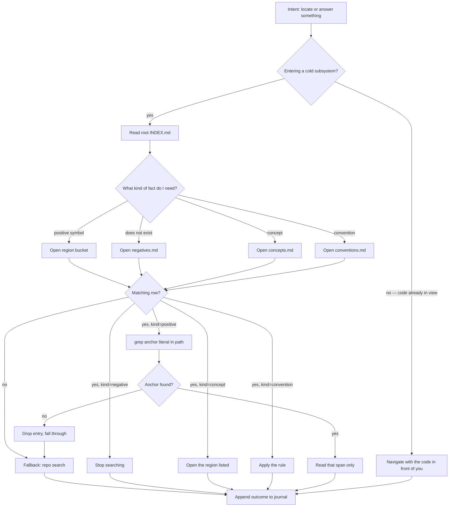
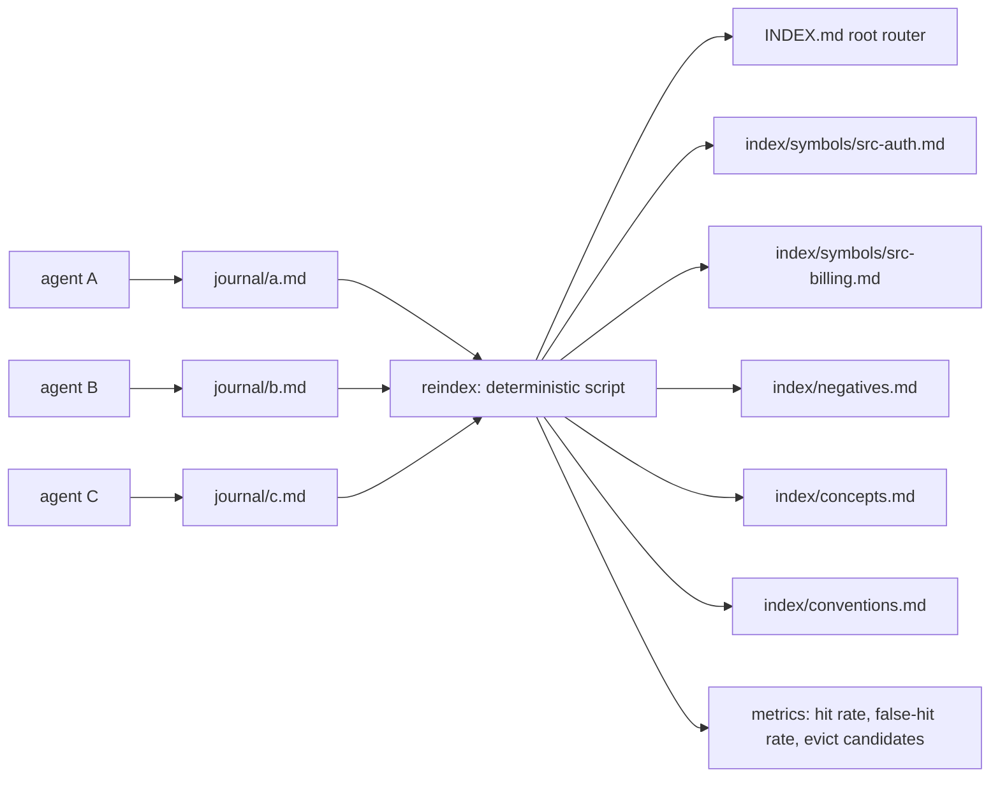
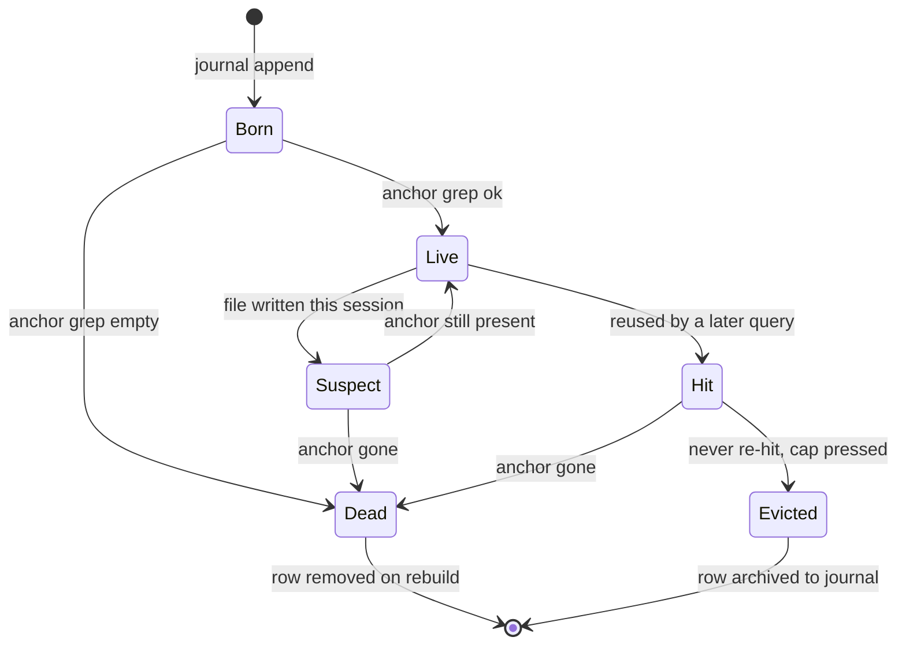

# Explore Index — Architecture of a Skill

> Status: design proposal, not built.
> Problem: agents re-explore the same code and burn tokens on facts they already established.
> Thesis: **the index is a routing table, not a cache.** Its job is to get you to the right
> *pool* in one or two cheap hops — never to make you read itself.

---

## 1. Why v0 (`explored.md`) loses

The flat 100-line memo is a correct idea with a broken cost model.

| | v0 flat memo | v2 categorical index |
|---|---|---|
| Cost on **hit** | read 100 lines (~1.5k tok) → read span | read root (~150 tok) → read 1 bucket (~300 tok) → grep anchor → read span |
| Cost on **miss** | read 100 lines (~1.5k tok) → full search | read root (~150 tok) → open 1 bucket (empty) → full search |
| Tax is paid | on *every* exploration | only on *entering a cold subsystem* |
| Handles "X does not exist" | no | yes, first class |
| Handles "where does auth live" | no | yes, region rows |

The miss case is what kills v0: a flat file taxes every single query, including the large
majority that will never hit. Break-even needs a ~33% hit rate *just to not lose*. A
hierarchical index cuts the per-lookup tax to a fraction of a branch and lets the root be
small enough to attach permanently.

### The economics, concretely

A repo-wide `grep`/`glob`/`read` sweep on a large codebase runs ~3k–15k tokens. A semantic
concept search — "is billing wired through X or Y" — routinely runs 3–8 tool calls because
the agent retries synonyms. The index must convert the second category into the first.

The single highest-value entry type is **proven-absent**. An agent that fails to find
`retryWithBackoff` will try `with_backoff`, then `backoff_retry`, then open three files
looking for it. That is ~5k tokens to re-derive a fact that one `grep` establishes. One line
kills all of it. v0 could not store this. v2 stores it natively.

---

## 2. Core design decisions

**D1 — Cache coordinates, never summaries.** Every entry resolves to a span that can be
verified by a literal string match. Nothing in the index asserts meaning about code. A stale
entry is *detectable*, never silently wrong. This is the property that makes an LLM-maintained
index survivable.

**D2 — Anchor, never line numbers.** Line numbers rot the moment anything above them is edited
— including by the agent itself, mid-session. The anchor is a literal substring; validating it
is one `grep`. Location and staleness resolve in the same call.

**D3 — Kind determines action, so kind is the first routing decision.** A positive hit means
*read this span*. A negative means *stop searching*. A convention means *apply this rule*.
Those are different verbs. Routing on kind first gets you to the right verb immediately.

**D4 — Spatial partitioning only where volume demands it.** Positives scale with codebase size
(10k symbols). Negatives, concepts, and conventions do not (tens of entries, ever). So positives
get a second hop; the rest are read whole in one.

**D5 — Judgment goes where a mistake is free.** The bucket *location* is derived mechanically
from the file path — never guessed. The *label* and *note* are free-form semantic prose, where
a bad guess costs a miss (fall through to search) and nothing more.

**D6 — One cheap always-attached root.** ~150 tokens, re-asserted in the prefix cache each
turn. The leaf branch is on demand.

**D7 — The journal is the source of truth; the index is a projection.** Agents append to
their own log. A deterministic script materializes the index. This removes the two-writers-one-
file corruption vector *and* gives you a free measurement instrument: the journal is a
query/result log, so hit rate falls out of running it against later queries.

---

## 3. On-disk layout

```
<repo>/
  .explore/
    INDEX.md              # Tier 0 — always attached. ~12 lines, no file contents.
    journal/
      a.md                # append-only, one per agent/session. never hand-edited.
      b.md
    index/                # GENERATED. never hand-edited.
      symbols/
        src-auth.md       # positive symbol locations, partitioned by region
        src-billing.md
        ...
      negatives.md        # proven-absent, with search scope
      concepts.md         # concept -> region
      conventions.md      # patterns, rules, gotchas
  AGENTS.md               # one line pointing at .explore/INDEX.md
```

### The routing table (this is the whole entry point)

```markdown
# Explore Index — read this before searching.

| Need | Open |
|---|---|
| Known symbol, in src/auth | index/symbols/src-auth.md |
| Known symbol, elsewhere   | INDEX.md → region list, then that file |
| "does X exist / is X wired" | index/negatives.md |
| "where does <concept> live" | index/concepts.md |
| "how does this repo do Y"   | index/conventions.md |

Bucket absent or no matching row → search normally, then journal the outcome.
Every search journals a line. Hits and misses both.
```

---

## 4. Entry schema

Four fields, each load-bearing:

```
<label> :: <bucket-ref> :: <anchor literal> :: <note ≤12 words>
```

| Field | Who decides | Why |
|---|---|---|
| `label` | **model, free-form** | query-shaped key; paraphrases and synonyms are unnecessary because the reader is an LLM, not a matcher |
| `bucket-ref` | **script, from path** | `path::symbol`, `REGION glob`, or `NOT_FOUND scope=…`. Never guessed |
| `anchor` | **model, literal** | the validator. Must be a string that exists verbatim in the file |
| `note` | **model, free-form** | the semantic payload: *why* it mattered, when to reuse. This is what a pure coordinate cache throws away |

Live examples:

```
shouldExpire session :: src/auth/session.ts::shouldExpire :: expires_at < now :: every refresh path funnels here
JWT verify            :: NOT_FOUND scope=src/**,tests/** :: (none) :: searched jsonwebtoken, jose, jwt-decode
auth entry point      :: REGION src/auth/** :: requireSession :: middleware chain begins at index.ts
retry helper          :: REGION src/** :: (none) :: no shared retry util; every service inlines backoff
```

That last row is the clearest argument for the design: **"there is no shared retry helper"**
cannot be discovered by any search, only by having looked. It is high-value, low-volume, and
impossible to derive mechanically.

---

## 5. Lookup path



**The gate at the top is the important correction to v0.** You do not consult the index before
every tool call. You consult it **once when entering a subsystem cold**. Once you have located
the region, you navigate with the code in view and the index adds nothing. v0's mistake was
taxing every call to serve a lookup that only pays off at subsystem boundaries.

### Hops and token cost

```
Tier 0  INDEX.md            ~150 tok   always attached, prefix-cached, effectively free after turn 1
Tier 1  kind bucket         ~300 tok   negatives / concepts / conventions: read whole, 1 hop
Tier 2  region bucket       ~300 tok   positives only, 2 hops
Leaf    grep anchor         ~200 tok   validates AND locates in a single call
        read span           ~400 tok   the actual payoff
                              ───────
Total on a symbol hit      ~1.05k tok   vs ~3k–15k for the search it replaces
Total on a miss             ~350 tok     vs ~1.5k for v0's flat tax
Total on a negative hit     ~450 tok     vs ~5k for a synonym-retry spiral
```

Branch factor 10, depth 2 — the arithmetic sweet spot. Depth 3 buys ~100 fewer tokens and
costs a third tool call, which loses on both latency and wrapper overhead.

---

## 6. Write path — journal, then project



**The agent never decides where an entry lands.** Writing requires a routing decision, and a
routing decision costs exactly the lookup we are trying to make free. So the agent appends one
line to its own journal in a format it already knows; the script partitions by path, sorts,
dedupes, caps, and rebalances lopsided buckets — all without a model call.

This also solves the concurrency problem from v0: N agents, N append-only journals, zero
shared writers. The index build is a separate read-only derivation.

And it hands you the experiment for free. The journal is `(query, outcome, cost)` per step, so
hit rate, miss reason, and false-hit rate are measurable rather than guessed.

---

## 7. Entry lifecycle



Three transitions cost the model nothing:

1. **Born → Live** — validated for free by the `grep` that located it in the first place.
2. **Live → Suspect** — a write hook on the edit tool flags every row whose `bucket-ref`
   names a touched path. Purely mechanical, no model judgment, no token cost.
3. **Hit → Evicted** — eviction is `hits asc, then age` when a bucket hits its cap. Zero-hit
   rows die first; proven-useful rows survive.

---

## 8. The trap in "make everything categorical"

Categorical purity is right for **storage** and incomplete for **routing**.

A bucket is a *kind*: positive, negative, concept, convention. That taxonomy is closed, and it
partitions storage cleanly. But a **query is free-form**. "how do we do retries" is not a
bucket name. Something has to bridge free-form query → closed bucket, and a closed bucket name
alone cannot do it.

The bridge is the **descriptor column** — a short natural-language gloss on every bucket row:

```
| Need | Open | Descriptor |
|---|---|---|
| "does X exist / is X wired" | index/negatives.md | proven absent, searched X, Y, Z |
```

Because the reader is an LLM, that descriptor can be lossy and paraphrased — `auth session`,
`who logs you in`, `JWT expiry` all route to the same bucket without an alias table, and no
deterministic index could do that. That is the genuine, specific argument for the semantic
route, and it is worth exactly this much: **it buys fuzzy routing, nothing more.**

**The cost of fuzzy routing is nondeterminism.** An LLM can be confidently, smoothly wrong
about which bucket it needs. That is acceptable *only* because the failure is a miss, and a
miss falls through to a normal search. Keep it that way:

> Never let the index directly determine an answer. It may only determine **where to look**.
> A wrong route costs one wasted hop. A wrong *assertion* costs a confident wrong answer.

Keep buckets few and descriptors distinct. Eight buckets with overlapping descriptions is the
actual risk — not the routing model.

---

## 9. Failure modes, ranked by how badly they'd burn you

| # | Failure | Detection | Response |
|---|---|---|---|
| 1 | **False hit** — index points at the wrong span | anchor grep lands on a *different* match, or note no longer matches code | kill design above ~2% |
| 2 | **Silent staleness** — file edited, anchor still present, meaning shifted | invisible | mitigated by the edit hook; accepted as residual risk |
| 3 | **Over-trust** — agent skips search because an entry "looks right" | rising false hits on concept queries | hard rule: index routes, never answers |
| 4 | **Bucket imbalance** — `src-auth.md` at 80 rows, everything else empty | per-bucket counts in reindex | per-bucket caps, not one global cap |
| 5 | **Note rot** — the semantic payload outlives its truth | none automated | cap note age; rebuild regenerates it |
| 6 | **Concurrency corruption** — two agents, one index file | merge conflict | structurally impossible: append-only journals |

**Measure these, in this order:** hit rate → miss *reason* → false-hit rate. Aggregate
token-saved is a lagging, misleading number; a design can show positive savings while the
false-hit rate quietly climbs, and that is the version that eventually burns you.

Run a known-good control inside every A/B batch. Sequential A/B matrices are confounded by
load, and a control that moved 3× between batches once taught me that lesson expensively.

---

## 10. Skill shape (if/when we build it)

```
SKILL.md
  ├─ trigger:  about to search a repo for a symbol or concept
  ├─ protocol: consult → locate → validate → journal        (model judgment)
  └─ scripts/
       ├─ journal.sh    append one line                       (no judgment)
       ├─ reindex.sh    journal → INDEX + buckets + metrics   (no judgment)
       └─ verify.sh     anchor-grep every row, mark Dead      (no judgment)
```

Three rules for the split:

1. **No model judgment in the scripts.** Bucketing, capping, validation, eviction — all of it is
   mechanical or it does not belong there.
2. **The skill does not search.** It composes with whatever `grep`/`glob`/`read` the host
   already has. Tool-agnostic means it survives a harness swap.
3. **Persistence is a human promotion, never automatic.** Session-scoped by default, since a
   durable index that outlives its repo state is a lie with extra steps. Promoting a session
   index into the repo is an explicit decision, reviewed by a human, keyed to a commit.

---

## 11. Open questions

1. **Does the root belong in the always-attached prompt, or in a tool description?** If it can
   live in a skill's tool description it costs ~0 marginal tokens per turn. Worth measuring
   against real prefix-caching behaviour before relying on either.
2. **Per-bucket vs per-region caps.** Region buckets vary enormously in size; a flat per-bucket
   cap starves busy regions while leaving cold ones bloated.
3. **Does the note earn its tokens?** The note is the semantic payload and the most
   defensible part of the design, but it is also the most likely to be noise. A/B it.
4. **Retention across compaction.** The journal survives; the model's own memory does not. Does
   the rebuild-from-journal step cost more than the re-exploration it prevents? Measurable on a
   long session.
5. **Is 2 hops enough, or does a hot session want 1?** Once an agent has read a region bucket,
   a within-session LRU of the last two buckets might beat re-reading the root each time.