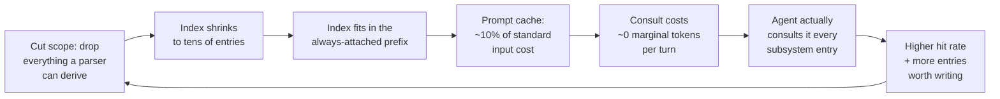
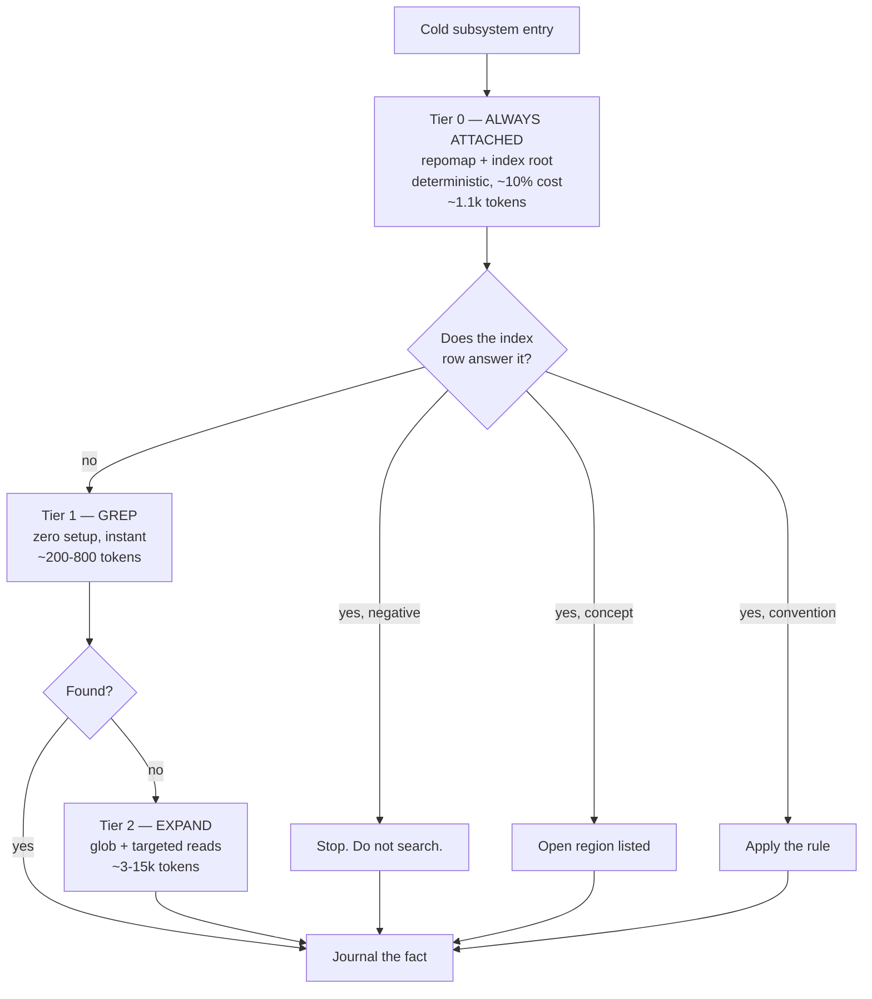

# Explore Index — The Efficiency Plan

> Companion to `explore-index-architecture.md`. That doc is the design. This one is what the
> research changed about it, and how we build it.
>
> Research current as of 2026-10-02. Every number below is sourced and, where it matters,
> checked against a primary source.

---

## 0. Headline findings that change the design

**1. A deterministic repo map already solves most of this, for free.**
Aider's repomap (tree-sitter + personalized PageRank) delivers the architectural spine of a
large codebase in **~87 tokens where reading the source would cost ~12,000** — deterministically,
refreshed from a SQLite cache keyed on file mtime, default budget 1,024 tokens.
([agentpatterns.ai](https://agentpatterns.ai/context-engineering/repository-map-pattern/),
[aider.chat/docs/repomap](https://aider.chat/docs/repomap.html))

→ **Anything the repomap can derive must not be in the explore index.** This is the single
biggest scope cut in the plan. Storing symbol→file is storing a worse, model-maintained copy
of something a parser produces perfectly for free.

**2. Don't wrap LSP. This is a measured negative result.**
*Does a Language Server Save Tokens for Coding Agents?* finds that on symbol-named
localization, LSP **increases** token cost — **+6% on Opus, +118% on Sonnet** — and that the
agent "ignores it entirely when free." It saves tokens only for the weakest model, as a crutch
against lexical noise. On reference-completeness it buys real precision (1.00 vs 0.76, zero
false call sites) but still costs a **+12–19% premium**.
([arXiv:2608.13568](https://arxiv.org/abs/2608.13568))

→ The asymmetry to exploit: **LSP costs money as a tool, costs nothing as a build-time
parser.** Use it inside `reindex.sh`. Never expose it to the agent.

**3. A structural index is a real, causal win — on multi-file work.**
*Code Isn't Memory* (SuperAGI, June 2026) ran a leak-audited, model-controlled ablation with
Claude Opus 4.7 held fixed across three seeds: file-localization acc@5 **44.3% → 84.5%**
(paired Wilcoxon p<0.0001), resolve **41.9% → 50.4%** (p=0.003), with lower cost per solve.
Their own deployment conclusion is the part that matters for us:

> the index lands at a lower $/solved than agentic grep — **but whether this pays off depends
> on whether the workload includes multi-file changes.**

→ Two consequences. The direction is validated, so build it. But it must be **gated on
multi-file work**, or we reproduce a win that doesn't exist for single-symbol lookups.

**4. The single most important methodological line in any of this.**
From the LSP paper: *"A method that 'saves tokens' by failing earlier has saved nothing."*
Savings must be measured **at iso-accuracy** — tokens-to-success, not tokens.

**5. Exploration really is the bill.** Independent corroboration: search and read operations
account for **56.2% of tool-use turns and 46.5% of total tokens** in a typical agent
workflow. Independently, context pruning (not indexation) yields 23–38% token reduction on
SWE-bench and cuts interaction rounds 18.2% (51.0 → 41.7) by eliminating "false-positive
search rabbit holes" — the exact pathology an index targets.
([alphaxiv 2606.14066](https://www.alphaxiv.org/overview/2606.14066),
[arXiv:2601.16746](https://arxiv.org/abs/2601.16746))

---

## 1. The scope cut — what to delete from v2

The architecture doc designed a positive-symbol index. **Cut it.**

| Entry type | Keep? | Why |
|---|---|---|
| symbol → file | **Delete** | tree-sitter repomap does this deterministically, at 87 tokens, for free |
| signature / call signature | **Delete** | repomap renders these, elided, inside the token budget |
| **proven-absent** | **Keep — promote to top tier** | impossible for any parser to know. Highest value per entry |
| **concept → region** | **Keep** | "where does auth live" is not a symbol query |
| **convention / gotcha** | **Keep** | architecture intent, not structure. Repomap is blind to it |
| **cross-file "X is wired through A not B"** | **Keep** | derived only from having traced it |
| "repomap was insufficient, actually here" | **Keep** | the residual the deterministic layer can't reach |

This leaves an index of **tens of entries, not thousands** — and that is not a compromise,
it is the entire point. See §2.

---

## 2. The core insight — a flywheel, not a cache

The efficiency gain is **not** faster lookup. It is converting the index from a
*lazily-read, occasionally-consulted file* into a *permanently-resident, near-free prior*.

Anthropic's prompt caching bills cached prefixes at roughly **10% of standard input cost**
([platform.claude.com](https://platform.claude.com/docs/en/build-with-claude/prompt-caching)).
At tens of entries the index is small enough to sit in that prefix permanently. That inverts
the v0 tradeoff entirely: v0 was "fast to skip, expensive to read"; this is "free to read,
always present."

**The flywheel is the whole design.** Any change that grows the index breaks it. Per-bucket
caps, note-length limits, and eviction are not hygiene — they are the load-bearing mechanism
that keeps the index small enough to be free.

> Corollary worth stealing from the research: static structure helps agents less by making
> them *smarter* and more by making their navigation **disciplined and reproducible**
> ([arxivsignals 2606.26979](https://arxivsignals.io/papers/2606.26979)). Tags raised
> link-following from 0.15–0.18 to 0.21–0.24, roughly halving run-to-run variance, at ~10%
> more input tokens. We are buying *discipline and stability*, not intelligence.

---

## 3. Three-tier routing

**Tier 0 must contain both** the deterministic repomap *and* the index root. They answer
different questions — "what exists" vs "what I already learned" — and an agent needs both to
decide whether a search is necessary at all. Keeping them merged in one always-attached
prefix means the decision costs zero marginal tokens.

Tier 2 is where the 46.5% of tokens goes. The entire goal is to convert Tier-2 work into
Tier-0 or Tier-1 work.

---

## 4. Measurement protocol

This is the part that decides whether the idea lives. Three corrections to the naive A/B.

### 4.1 Iso-accuracy, not token count

**Tokens-to-success is the only primary metric.** A run that saves tokens by giving up is a
loss. Measure: (tokens spent) / (tasks resolved), at matched accuracy. If accuracy differs,
the comparison is void.

### 4.2 Gate on workload shape

Two arms, because the prior says the effect is workload-dependent:

- **Arm A — single-symbol localization.** Expect ~0 win. Run it to *falsify* the hypothesis,
  and to catch the case where we regress.
- **Arm B — multi-file change.** Expect the win. This is where structural ranking pays off.

Do not report an aggregate across both. An aggregate hides precisely the conditional structure
that the research says exists.

### 4.3 Gate on repo size

Below ~20 files the whole thing gains nothing — reading the source fits in a context window
and beats signatures. Gate on file count and skip.

### 4.4 Controls and confounders

- **Known-good control inside every batch**, not at the start of the run. Sequential A/B
  matrices are confounded by load; a control that scored 16/16 earlier scored 3/5 inside a
  batch, and a real payload outscored a stripped one. A batch without a control proves
  nothing.
- **Interleave arms**, don't run them in blocks.
- **The harness must live outside the indexed tree.** A test file containing the query string
  becomes its own top-ranked candidate — this happened to me before and it silently poisons
  localization accuracy.

### 4.5 Metrics to log per exploration

| Metric | Why it exists |
|---|---|
| tier reached (0/1/2) | the primary outcome — did we convert work downward |
| hit / miss | does the index earn its keep |
| **false hit** | the dangerous one. Anchor grep lands on a *different* match |
| tokens avoided | secondary, only meaningful at iso-accuracy |
| miss reason | the only way to learn what entry type is missing |

**Kill criterion:** false-hit rate > 2%. Not a tuning knob — a design failure. A false hit
does not look like a failure; it looks like a confident wrong answer.

---

## 5. Build order

Each step is independently shippable and independently falsifiable. Do not build ahead.

| # | Step | Falsified by |
|---|---|---|
| 0 | **Repomap baseline.** Wire tree-sitter + PageRank. Measure. | — (this is the control) |
| 1 | **Negative-only index.** Proven-absent facts, ~20 entries. | no drop in tier-2 rate |
| 2 | **Concept + convention rows.** | hit rate below ~25% |
| 3 | **Journal + reindex script.** Mechanical, no model judgment. | build is not reproducible |
| 4 | **Edit hook.** Drop rows on touched paths. Zero token cost. | measurable staleness remains |
| 5 | **Prefix-resident tier 0.** Move index into the cached prefix. | no change in consultation rate |

Step 1 before step 2 deliberately: negatives are the highest value per entry and the cheapest
to test. If the *easy* case doesn't move tier-2 rate, the concept layer won't either.

**Explicitly out of scope, and why:**
- **LSP as a tool** — measured token *increase* ([2608.13568](https://arxiv.org/abs/2608.13568)).
- **Dense vector index** — the repomap already covers structural locality; embeddings add
  staleness and cost. Revisit only if steps 1–2 fail.
- **Dedicated explorer subagent** — the strongest result here was **withdrawn from arXiv** for
  *"product IP issues"*, not scientific merit. The direction is plausible and expensive to
  build; park it until steps 0–3 are measured.

---

## 6. Open questions

1. **Can the index root live in a skill's tool description** rather than the system prompt?
   Then it costs ~0 marginal tokens and never competes for prefix space.
2. **Does the note field earn its tokens?** It is the semantic payload and the most
   defensible part of the design — and the most likely to be noise. A/B it.
3. **Hub-heavy repos** reportedly benefit from inverse-only links ("who calls me", no forward
   edges) ([arxivsignals 2606.26979](https://arxivsignals.io/papers/2606.26979)). Relevant if
   we ever extend the repomap, not to v1.
4. **Repomap staleness.** Aider's map is recomputed per session, not per edit. In a fast-moving
   repo the AST goes stale within minutes. Our anchor-grep validation is the hedge — worth
   measuring whether it closes that gap.

---

## Sources

- Aider repo map — https://aider.chat/docs/repomap.html · https://agentpatterns.ai/context-engineering/repository-map-pattern/
- Code Isn't Memory (SuperAGI) — https://arxiv.org/abs/2606.22417
- Does a Language Server Save Tokens? — https://arxiv.org/abs/2608.13568
- SWE-Pruner — https://arxiv.org/abs/2601.16746
- FastContext — https://arxiv.org/abs/2606.14066 (**withdrawn**, v4, product IP)
- Deterministic Anchoring — https://arxivsignals.io/papers/2606.26979
- Prompt caching — https://platform.claude.com/docs/en/build-with-claude/prompt-caching